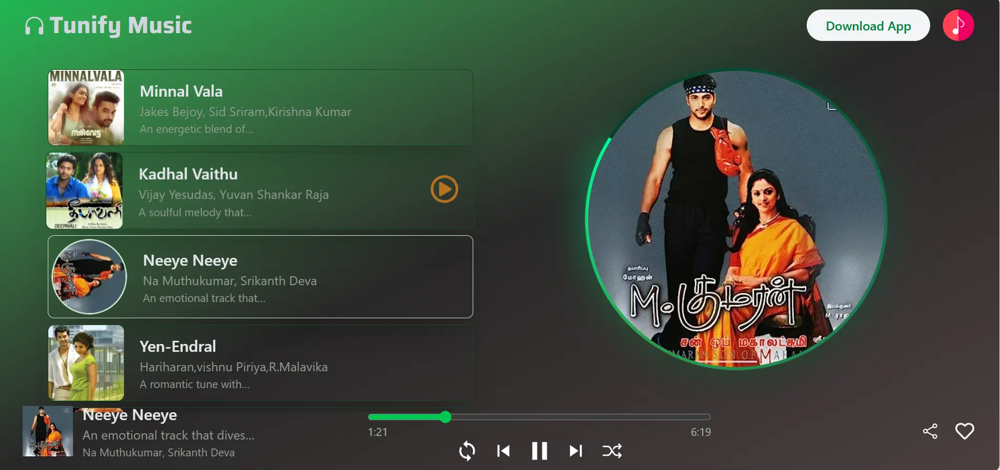
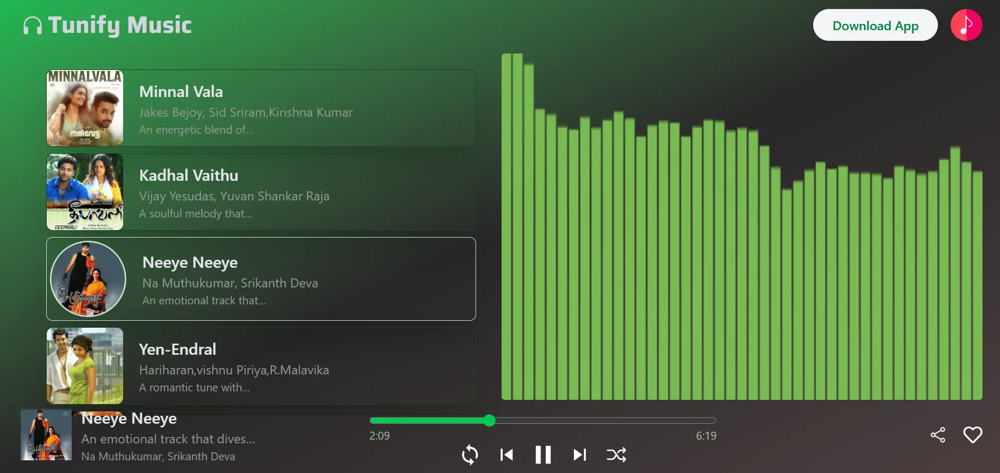

# 🎵 Tunify Music Player

Tunify is a modern, responsive React music player that lets you stream your favorite songs with a beautiful UI and smooth playback experience.

## 🚀 Features

- Browse and play a curated list of songs.
- Animated album art and waveform visualizer.
- Responsive design for desktop and mobile.
- Smooth transitions and interactive UI.
- Built with React, Tailwind CSS, and Swiper.

## 🖼️ Screenshots

### Home Page


### Player & Visualizer


## 🛠️ Getting Started

1. **Clone the repository:**
   ```sh
   git clone https://github.com/Thanushangit/Music-app.git
   cd Music-app
   ```

2. **Install dependencies:**
   ```sh
   npm install
   ```

3. **Run the development server:**
   ```sh
   npm run dev
   ```

4. **Build for production:**
   ```sh
   npm run build
   ```

## 👤 Author

- **S. Thanushan**
- 🌐 [Website](https://thanushan-dev.vercel.app/)

## 📄 License

This project is licensed under the MIT License.

---

Enjoy seamless music playback with Tunify!  
Feel free to contribute or suggest features.